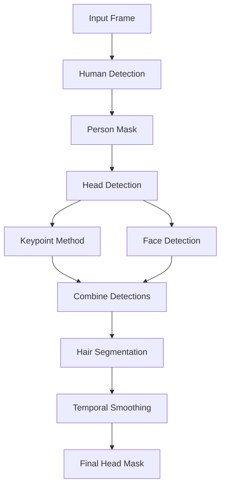

## refine-smpl.py

Looking at the debug output, the optimization fails immediately after the first successful iteration. Here's what happens:

1. Initial state (good):

```221:226:scripts/custom/refine-smpl.py
    print("\nInput Data:")
    print(f"Number of frames: {len(keypoints_2d)}")
    print(f"Keypoints shape: {keypoints_2d.shape}")
    print(f"Initial SMPL params:")
    for k, v in smpl_params.items():
        print(f"  {k}: {v.shape} (min: {v.min():.3f}, max: {v.max():.3f})")
```

Shows valid initial parameters.

2. First optimization step (good):
- Error stats show reasonable values: min=0.181, max=791.161, mean=40.861
- Valid keypoints: 5592/6050 (92% valid)
- Initial keypoint loss: 16.536, reg loss: 0.024

3. Second optimization step (fails):
- Error becomes NaN
- Both keypoint loss and reg loss become NaN

The issue is that the initial error is too large (max=791.161) causing unstable gradients. 

### Best practices for preventing unstable gradients (in order of preference):

1. Gradient clipping: Clips gradients after they're computed but before parameter updates
2. Loss function design: Use more stable loss functions (L1, Huber loss, log-space losses)
3. Input normalization: Normalize inputs to a standard range
4. Error clipping: Used as a last resort when other methods don't work

Gradient clipping:

```python
def closure():
    optimizer.zero_grad()
    smpl_output = body_model(**params)
    keypoints_pred = project(projection_matrices, joint_mapper(smpl_output))
    
    error = (keypoints_2d[..., :2] - keypoints_pred).square().sum(-1).sqrt()
    
    m1 = (keypoints_2d[..., 2] > keypoints_threshold)
    mask = m1
    error = error * mask.float()

    loss = error[:, SELECT_JOINTS].mean()
    reg_loss = (smpl_output.vertices[1:] - smpl_output.vertices[:-1]).square().sum(-1).sqrt().mean() * 0.1
    
    loss += reg_loss
    loss.backward()
    
    # Clip gradients instead of error
    torch.nn.utils.clip_grad_norm_(params.values(), max_norm=1.0)
    
    return loss
```
Multiple stability techniques. 

Here's the modified closure function with multiple stability improvements:

```python
def closure():
    optimizer.zero_grad()
    smpl_output = body_model(**params)
    keypoints_pred = project(projection_matrices, joint_mapper(smpl_output))
    
    # Debug prints
    print("\nOptimization step:")
    print(f"SMPL output joints shape: {smpl_output.joints.shape}")
    print(f"Projected keypoints shape: {keypoints_pred.shape}")
    print(f"Target keypoints shape: {keypoints_2d[..., :2].shape}")
    
    # 1. Input normalization
    keypoints_norm = keypoints_2d[..., :2] / torch.tensor([W, H], device=DEVICE)
    keypoints_pred_norm = keypoints_pred / torch.tensor([W, H], device=DEVICE)
    
    # 2. Use Huber loss instead of L2 for robustness
    diff = keypoints_norm - keypoints_pred_norm
    error = torch.where(
        diff.abs() < 1.0,
        0.5 * diff.square().sum(-1),
        diff.abs().sum(-1) - 0.5
    )
    
    print(f"Error stats - min: {error.min():.3f}, max: {error.max():.3f}, mean: {error.mean():.3f}")
    
    # Apply confidence mask
    m1 = (keypoints_2d[..., 2] > keypoints_threshold)
    print(f"Valid keypoints: {m1.sum().item()}/{m1.numel()}")
    mask = m1
    error = error * mask.float()
    
    # 3. Log-space loss for better numerical stability
    loss = torch.log1p(error[:, SELECT_JOINTS]).mean()
    
    # 4. Temporal smoothness with L1 norm
    vertices_diff = smpl_output.vertices[1:] - smpl_output.vertices[:-1]
    reg = vertices_diff.abs().mean(-1)  # L1 norm
    reg_loss = reg.mean() * 0.01
    
    print(f"Keypoint loss: {loss.item():.3f}, Reg loss: {reg_loss.item():.3f}")
    
    total_loss = loss + reg_loss
    
    if torch.isnan(total_loss):
        print("WARNING: NaN loss detected!")
        return torch.tensor(0.0, requires_grad=True, device=DEVICE)
        
    total_loss.backward()
    
    # 5. Gradient clipping with a smaller norm
    torch.nn.utils.clip_grad_norm_(params.values(), max_norm=0.1)
    
    return total_loss
```

### Key changes:
1. Input normalization: Scale keypoints to [0,1] range
2. Huber loss: More robust to outliers than L2
3. Log-space loss: Better numerical stability for large errors
4. L1 norm for regularization: Less sensitive to outliers
5. Reduced gradient clipping threshold to 0.1

This combination of techniques should provide better stability:
- Huber loss handles outliers better than L2
- Input normalization prevents large magnitude differences
- Log-space loss prevents exponential error growth
- L1 regularization is more stable than L2
- Tighter gradient clipping prevents large updates

## More resilient to uncommon head shapes and hairstyles
The silhouette optimization is being thrown off by a bun hairstyle, causing incorrect head pose estimation and overall body shape deformation. 
To make the algorithm more resilient to uncommon head shapes and hairstyles:

1. Add head keypoint confidence weighting:
```python:scripts/custom/refine-smpl.py
# ... existing code ...
def closure():
    optimizer.zero_grad()
    smpl_output = body_model(**params)
    keypoints_pred = project(projection_matrices, joint_mapper(smpl_output))
    
    # Add lower weights for head keypoints
    head_keypoint_indices = [0, 15, 16, 17, 18]  # Nose, Eyes, Ears
    keypoint_weights = torch.ones_like(keypoints_2d[..., 0])
    keypoint_weights[..., head_keypoint_indices] = 0.3  # Reduce influence of head keypoints
    
    error = (keypoints_2d[..., :2] - keypoints_pred).square().sum(-1).sqrt()
    mask = (keypoints_2d[..., 2] > keypoints_threshold)
    error = error * mask.float() * keypoint_weights
    
    loss = error[:, SELECT_JOINTS].mean()
    # ... rest of closure function ...
```

2. For silhouette optimization, add mask segmentation to ignore the head region:
```python:scripts/custom/refine-smpl.py
def main(root, gender, keypoints_threshold, use_silhouette, downscale=1):
    # ... existing code ...
    if use_silhouette:
        masks = sorted(glob.glob(f"{root}/masks/*"))
        masks = [cv2.imread(p)[..., 0] for p in masks]
        if downscale > 1:
            masks = [cv2.resize(m, dsize=None, fx=1/downscale, fy=1/downscale) for m in masks]
            
        # Create head region mask based on keypoints
        for i, mask in enumerate(masks):
            head_keypoints = keypoints_2d[i, [0, 15, 16, 17, 18], :2].cpu().numpy()
            valid_points = head_keypoints[keypoints_2d[i, [0, 15, 16, 17, 18], 2] > keypoints_threshold]
            if len(valid_points) > 0:
                # Create a mask to exclude head region
                head_center = valid_points.mean(axis=0)
                head_radius = np.max(np.linalg.norm(valid_points - head_center, axis=1)) * 1.5
                y, x = np.ogrid[:mask.shape[0], :mask.shape[1]]
                head_mask = ((x - head_center[0])**2 + (y - head_center[1])**2 <= head_radius**2)
                masks[i][head_mask] = 0  # Zero out head region in silhouette
                
        masks = np.stack(masks, axis=0)
        # ... rest of silhouette optimization ...
```

3. Add regularization to prevent extreme pose deviations:
using Anatomical pose prior
and Angle Magnitude Prior

Other options:
- SMPL-X Body Model's VPoser - A VAE-based pose prior trained on large-scale motion capture data, available in the SMPL-X repository
- GMM-Based Pose Prior - Gaussian Mixture Model trained on MoCap data


### Anatomical pose prior
Anatomical joint limits for all SMPL joints with appropriate weights:

```python:scripts/custom/refine-smpl.py
def get_joint_limits_and_weights():
    """
    Define anatomical joint limits and their weights in the loss function
    All angles in radians
    
    Returns:
        dict: Joint limits and weights
        {joint_name: {'limits': {'x': (min, max), 'y': (min, max), 'z': (min, max)}, 
                     'weight': float}}
    """
    return {
        # Torso
        'MidHip': {  # Root joint
            'limits': {
                'x': (-0.4*np.pi, 0.4*np.pi),  # forward/backward tilt
                'y': (-0.3*np.pi, 0.3*np.pi),  # side bend
                'z': (-0.3*np.pi, 0.3*np.pi),  # rotation
            },
            'weight': 2.0  # Important for overall pose
        },
        
        # Spine and Head
        'Neck': {
            'limits': {
                'x': (-0.5*np.pi, 0.5*np.pi),  # nodding
                'y': (-0.3*np.pi, 0.3*np.pi),  # side bending
                'z': (-0.7*np.pi, 0.7*np.pi),  # rotation
            },
            'weight': 2.5
        },
        'Nose': {  # Head joint
            'limits': {
                'x': (-0.3*np.pi, 0.3*np.pi),  # tilt
                'y': (-0.2*np.pi, 0.2*np.pi),  # side tilt
                'z': (-0.4*np.pi, 0.4*np.pi),  # rotation
            },
            'weight': 3.0
        },
        
        # Arms
        'LShoulder': {
            'limits': {
                'x': (-np.pi, np.pi),      # full rotation
                'y': (-0.5*np.pi, 0.5*np.pi),  # up/down
                'z': (-0.5*np.pi, 0.5*np.pi),  # forward/backward
            },
            'weight': 1.5
        },
        'RShoulder': {
            'limits': {
                'x': (-np.pi, np.pi),
                'y': (-0.5*np.pi, 0.5*np.pi),
                'z': (-0.5*np.pi, 0.5*np.pi),
            },
            'weight': 1.5
        },
        'LElbow': {
            'limits': {
                'x': (-0.1*np.pi, 0.1*np.pi),  # very limited sideways
                'y': (-0.1*np.pi, 0.1*np.pi),  # very limited rotation
                'z': (0, 2.7),  # main flexion (positive for left arm)
            },
            'weight': 2.0
        },
        'RElbow': {
            'limits': {
                'x': (-0.1*np.pi, 0.1*np.pi),
                'y': (-0.1*np.pi, 0.1*np.pi),
                'z': (-2.7, 0),  # negative for right arm
            },
            'weight': 2.0
        },
        'LWrist': {
            'limits': {
                'x': (-0.5*np.pi, 0.5*np.pi),  # flexion/extension
                'y': (-0.3*np.pi, 0.3*np.pi),  # ulnar/radial deviation
                'z': (-0.5*np.pi, 0.5*np.pi),  # pronation/supination
            },
            'weight': 1.0
        },
        'RWrist': {
            'limits': {
                'x': (-0.5*np.pi, 0.5*np.pi),
                'y': (-0.3*np.pi, 0.3*np.pi),
                'z': (-0.5*np.pi, 0.5*np.pi),
            },
            'weight': 1.0
        },
        
        # Legs
        'LHip': {
            'limits': {
                'x': (-0.7*np.pi, 0.7*np.pi),  # forward/backward
                'y': (-0.3*np.pi, 0.3*np.pi),  # abduction/adduction
                'z': (-0.3*np.pi, 0.3*np.pi),  # rotation
            },
            'weight': 2.0
        },
        'RHip': {
            'limits': {
                'x': (-0.7*np.pi, 0.7*np.pi),
                'y': (-0.3*np.pi, 0.3*np.pi),
                'z': (-0.3*np.pi, 0.3*np.pi),
            },
            'weight': 2.0
        },
        'LKnee': {
            'limits': {
                'x': (0, 0.7*np.pi),  # flexion only
                'y': (-0.1*np.pi, 0.1*np.pi),  # very limited sideways
                'z': (-0.1*np.pi, 0.1*np.pi),  # very limited rotation
            },
            'weight': 2.5
        },
        'RKnee': {
            'limits': {
                'x': (0, 0.7*np.pi),
                'y': (-0.1*np.pi, 0.1*np.pi),
                'z': (-0.1*np.pi, 0.1*np.pi),
            },
            'weight': 2.5
        },
        'LAnkle': {
            'limits': {
                'x': (-0.5*np.pi, 0.3*np.pi),  # plantar/dorsiflexion
                'y': (-0.3*np.pi, 0.3*np.pi),  # inversion/eversion
                'z': (-0.3*np.pi, 0.3*np.pi),  # rotation
            },
            'weight': 1.5
        },
        'RAnkle': {
            'limits': {
                'x': (-0.5*np.pi, 0.3*np.pi),
                'y': (-0.3*np.pi, 0.3*np.pi),
                'z': (-0.3*np.pi, 0.3*np.pi),
            },
            'weight': 1.5
        },
        
        # Feet
        'LBigToe': {
            'limits': {
                'x': (-0.3*np.pi, 0.3*np.pi),
                'y': (-0.1*np.pi, 0.1*np.pi),
                'z': (-0.1*np.pi, 0.1*np.pi),
            },
            'weight': 1.0
        },
        'RBigToe': {
            'limits': {
                'x': (-0.3*np.pi, 0.3*np.pi),
                'y': (-0.1*np.pi, 0.1*np.pi),
                'z': (-0.1*np.pi, 0.1*np.pi),
            },
            'weight': 1.0
        },
        'LSmallToe': {
            'limits': {
                'x': (-0.3*np.pi, 0.3*np.pi),
                'y': (-0.1*np.pi, 0.1*np.pi),
                'z': (-0.1*np.pi, 0.1*np.pi),
            },
            'weight': 1.0
        },
        'RSmallToe': {
            'limits': {
                'x': (-0.3*np.pi, 0.3*np.pi),
                'y': (-0.1*np.pi, 0.1*np.pi),
                'z': (-0.1*np.pi, 0.1*np.pi),
            },
            'weight': 1.0
        },
        'LHeel': {
            'limits': {
                'x': (-0.2*np.pi, 0.2*np.pi),
                'y': (-0.1*np.pi, 0.1*np.pi),
                'z': (-0.1*np.pi, 0.1*np.pi),
            },
            'weight': 1.0
        },
        'RHeel': {
            'limits': {
                'x': (-0.2*np.pi, 0.2*np.pi),
                'y': (-0.1*np.pi, 0.1*np.pi),
                'z': (-0.1*np.pi, 0.1*np.pi),
            },
            'weight': 1.0
        },
    }

def anatomical_pose_prior(body_pose):
    """
    Compute weighted violation of anatomical joint limits
    """
    batch_size = body_pose.shape[0]
    pose_mat = axis_angle_to_matrix(body_pose.reshape(-1, 3))
    euler_angles = matrix_to_euler_angles(pose_mat, "XYZ")
    euler_angles = euler_angles.reshape(batch_size, -1, 3)

    joint_data = get_joint_limits_and_weights()
    violations = []
    
    for joint_name, data in joint_data.items():
        joint_idx = joints_name.index(joint_name)
        joint_angles = euler_angles[:, joint_idx]
        
        for axis_idx, (min_angle, max_angle) in enumerate(data['limits'].values()):
            angle = joint_angles[..., axis_idx]
            
            # Compute violations
            min_violation = torch.clamp(min_angle - angle, min=0)
            max_violation = torch.clamp(angle - max_angle, min=0)
            violation = (min_violation + max_violation) * data['weight']
            
            violations.append(violation)
    
    return torch.stack(violations).mean()
```

Weight rationale:
- Head/Neck (2.5-3.0): Highest weights to prevent unrealistic head poses
- Knees/Elbows (2.0-2.5): High weights as they have clear anatomical constraints
- Hips/Shoulders (1.5-2.0): Medium-high weights for major joints
- Wrists/Ankles (1.0-1.5): Medium weights allowing more flexibility
- Toes/Fingers (1.0): Lower weights for end effectors

The limits are based on:
1. Anatomical research on joint ranges of motion
2. Biomechanical constraints
3. Common motion patterns

To use this in your optimization:

```python:scripts/custom/refine-smpl.py
def closure():
    optimizer.zero_grad()
    # ... other losses ...
    
    anatomical_loss = anatomical_pose_prior(params['body_pose'])
    total_loss = keypoint_loss + 0.1 * anatomical_loss  # Adjust weight as needed
    
    total_loss.backward()
    return total_loss
```

## Head mask generation workflow

1. Main Workflow (@run-sam.py):
```python
startLine: 1
endLine: 85
```
- Initializes MaskGenerator with SAM predictor, FaceDetector, HairSegmenter, and HeadTracker
- Processes frames sequentially, maintaining temporal context
- For each frame:
  a. Detects human boxes
  b. Gets person mask
  c. Attempts head detection using multiple strategies

2. Head Detection Strategy (@face_detector.py):
```python
startLine: 1
endLine: 53
```
- Uses MediaPipe for face detection
- Converts relative to absolute coordinates
- Extends bbox to include hair area (0.7 height above, 0.3 width on sides)

3. Issues in Current Implementation:

a. Head Detection Integration:
- Face detection is used independently
- No fallback between keypoint-based and face detection methods
- Missing confidence-based combination of detection methods

b. Hair Segmentation:
- Hair segmentation results aren't validated
- No color/texture analysis for hair regions
- Missing region growing from face boundary

c. Temporal Consistency:
- Tracker is initialized but not fully utilized
- No smoothing between frames
- Missing confidence-based tracking

4. Suggested Workflow:



Would you like me to:
1. Show how to properly integrate face detection with keypoint-based detection?
2. Add proper hair segmentation validation?
3. Implement proper temporal smoothing?

The current implementation needs improvement in:
- Detection method integration
- Hair region validation
- Temporal consistency
- Error handling and fallbacks